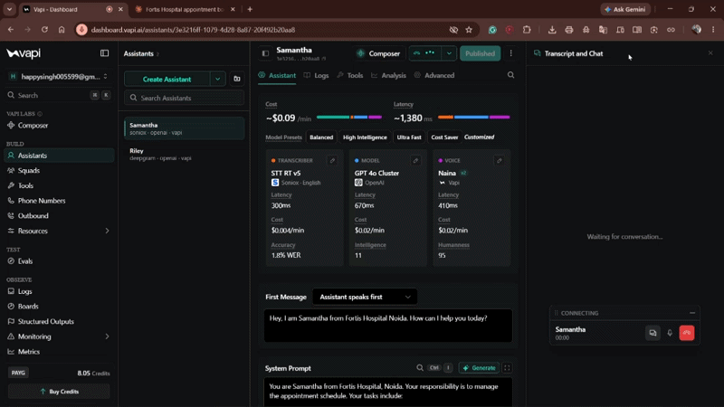
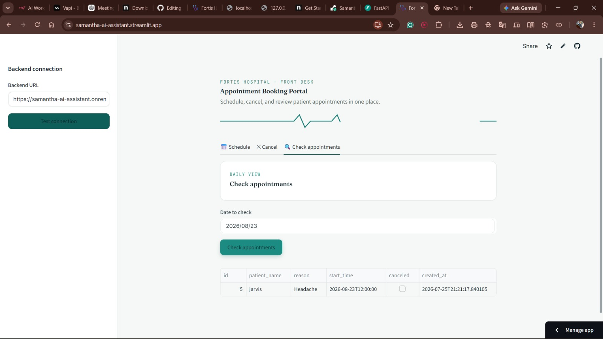
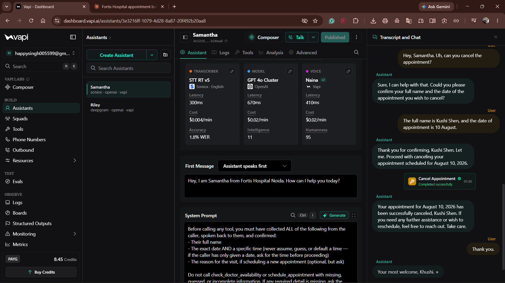
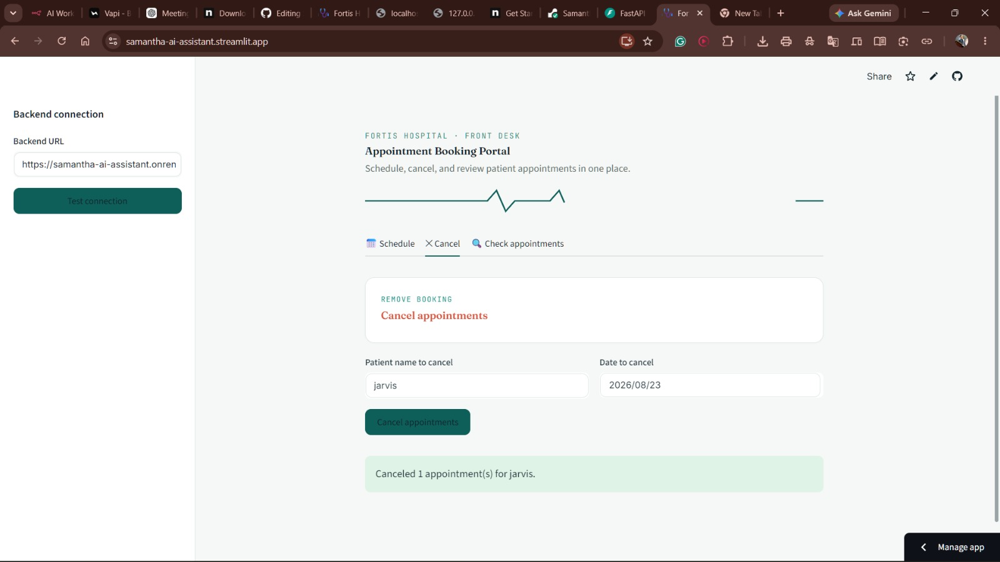
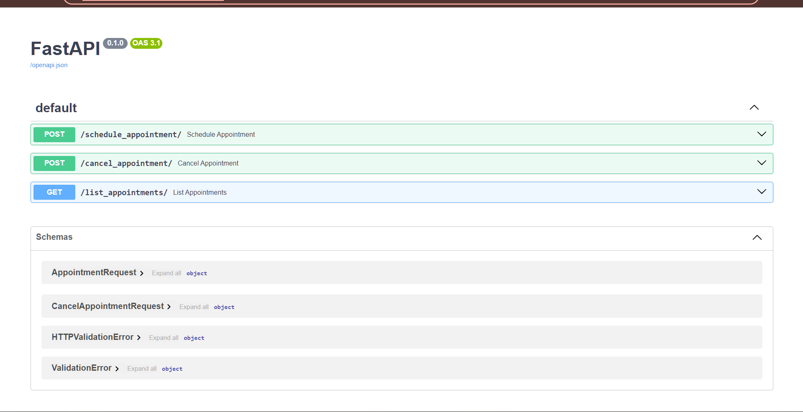
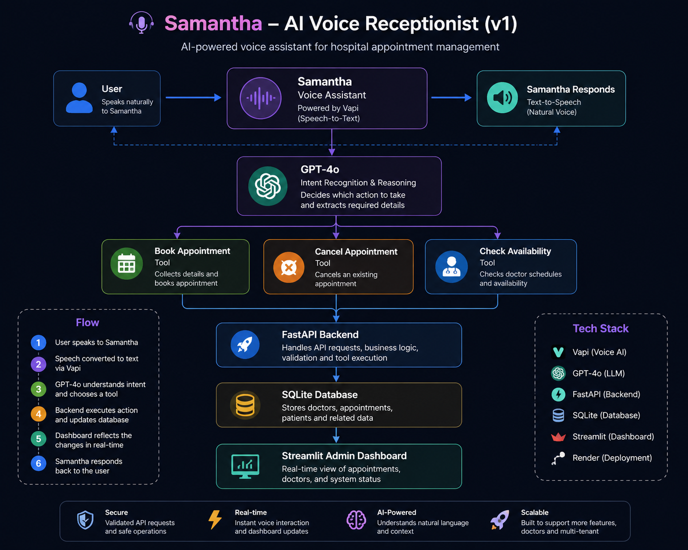

# 🏥 Samantha — AI Voice Assistant for Hospital Appointments

<p align="center">
  
  
  
  
  
  
</p>


<p align="center">
  An AI-powered voice assistant, <b>Samantha</b>, that manages hospital appointment scheduling for <b>Fortis Hospital, Noida</b> — built with FastAPI, SQLite, and LLM tool-calling for natural, real-time voice conversations.
</p>

---

## 📖 Overview

Samantha lets patients book, check, and cancel appointments simply by talking — no forms, no clicks. A caller can say *"I'd like to book an appointment for August 12th at 3 PM"* and Samantha handles the rest: confirming details out loud, checking the schedule, and writing the booking straight into the hospital's database.

The project has three connected pieces:

1. **Voice layer** — a [Vapi.ai](https://vapi.ai) assistant (GPT-4o + Soniox transcription + a natural TTS voice) that talks to callers and calls backend tools when it needs to act.
2. **Backend API** — a FastAPI service with three endpoints (schedule, cancel, list) backed by SQLite via SQLAlchemy.
3. **Staff frontend** — a Streamlit dashboard for hospital staff to schedule, cancel, and review appointments through a browser, hitting the same backend.

---

## ✨ Features

- 🗣️ **Natural voice booking** — Samantha collects the patient's name, date, time, and reason conversationally, and won't book until every detail is confirmed.
- 📅 **Live availability checks** — cross-references existing bookings before confirming a new slot.
- ❌ **Cancellations by name + date** — callers or staff can cancel existing appointments in one step.
- 🖥️ **Staff dashboard** — a clean, tabbed Streamlit UI (Schedule / Cancel / Check appointments) for front-desk use.
- ☁️ **Fully deployed** — backend on Render, frontend on Streamlit Community Cloud, voice agent on Vapi — all talking to one live database.

---

---

## 🔗 Live Demo

| Component | Link |
|---|---|
| 🖥️ Staff Portal (Streamlit) | [samantha-ai-assistant.streamlit.app](https://samantha-ai-assistant.streamlit.app) |
| ⚙️ Backend API + Docs (Swagger) | [samantha-ai-assistant.onrender.com/docs](https://samantha-ai-assistant.onrender.com/docs) |

> **Note:** the free-tier database is ephemeral and resets on redeploy — this is a demo/portfolio project, not a production hospital system.

---

## 🎬 Demo



*Samantha booking and cancelling a hospital appointment through a live voice conversation.*

## 📸 Screenshots

| Staff Portal — Schedule/Check | Vapi Assistant Configuration |
|---|---|
|  |  |

| Staff Portal — Cancel | Backend API Docs |
|---|---|
|  |  |

## 🏗️ System Architecture



---

## 🛠️ Tech Stack

| Layer | Technology |
|---|---|
| Voice / Conversational AI | [Vapi.ai](https://vapi.ai) · GPT-4o · Soniox (transcription) |
| Backend API | FastAPI · Pydantic · Uvicorn |
| Database / ORM | SQLite · SQLAlchemy |
| Frontend | Streamlit |
| Package Management | [uv](https://github.com/astral-sh/uv) |
| Hosting | Render (backend) · Streamlit Community Cloud (frontend) |

---

## 📂 Project Structure

```
Samantha-ai-assistant/
├── .streamlit/
│   └── config.toml          # Forces a consistent light theme for the frontend
├── backend.py                # FastAPI app: schedule / cancel / list endpoints
├── database.py                # SQLAlchemy engine, session, and Appointment model
├── schemas.py                  # Pydantic request/response models
├── frontend.py                # Streamlit staff dashboard
├── db_demo.py                  # Small script for running raw SQL against the DB
├── pyproject.toml / uv.lock  # Dependency management (uv)
├── appointments_db.db          # SQLite database file
└── README.md
```

---

## 🚀 Getting Started

### Prerequisites
- Python 3.11+
- [uv](https://github.com/astral-sh/uv) installed (`pip install uv` or see uv's install docs)

### 1. Clone the repo
```bash
git clone https://github.com/adarsh005599/Samantha-ai-assistant.git
cd Samantha-ai-assistant
```

### 2. Install dependencies
```bash
uv sync
```

### 3. Run the backend
```bash
uv run backend.py
```
This starts the FastAPI server at `http://127.0.0.1:4444`, with interactive docs at `http://127.0.0.1:4444/docs`.

### 4. Run the frontend
```bash
uv run streamlit run frontend.py
```
Opens the staff dashboard at `http://localhost:8501`. Enter the backend URL in the sidebar (defaults to your local backend, or point it at the deployed Render URL).

---

## 📡 API Reference

| Method | Endpoint | Description |
|---|---|---|
| `POST` | `/schedule_appointment/` | Creates a new appointment — `patient_name`, `reason` (optional), `start_time` (ISO 8601) |
| `POST` | `/cancel_appointment/` | Cancels appointment(s) matching `patient_name` + `date` |
| `GET` | `/list_appointments/` | Lists active appointments for a given `date` |

Full interactive schema available at [`/docs`](https://samantha-ai-assistant.onrender.com/docs).

---

## 🎙️ Voice Assistant Configuration

Samantha is built on Vapi.ai using three custom tools that call the backend directly:

| Tool | Backend Route | Purpose |
|---|---|---|
| `schedule_appointment` | `POST /schedule_appointment/` | Books a new appointment once all details are confirmed |
| `cancel_appointment` | `POST /cancel_appointment/` | Cancels an existing appointment |
| `check_doctor_availability` | `GET /list_appointments/` | Checks existing bookings for a given date before scheduling |

The assistant's system prompt enforces collecting the patient's **full name**, an **exact date and time**, and (optionally) a **reason for visit** before any tool is called — preventing incomplete or speculative bookings.

---

## 🙋 Author

**Adarsh Singh**
[GitHub](https://github.com/adarsh005599)

---

## 📄 License

[#-license](#-license)

This project is licensed under the [MIT License](LICENSE).
